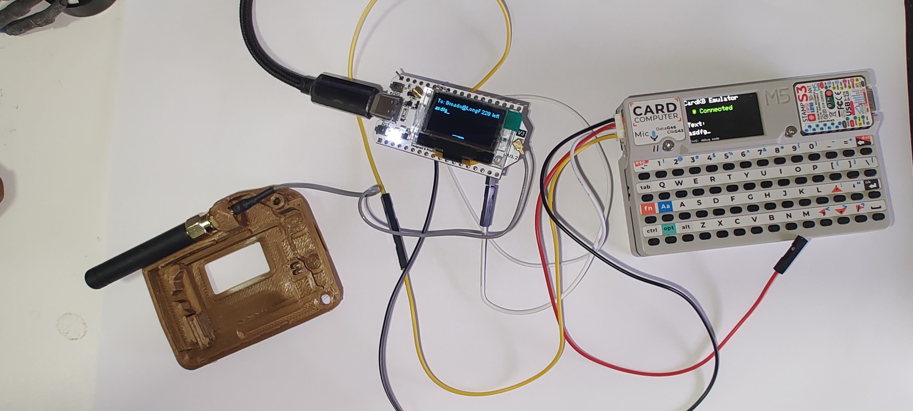
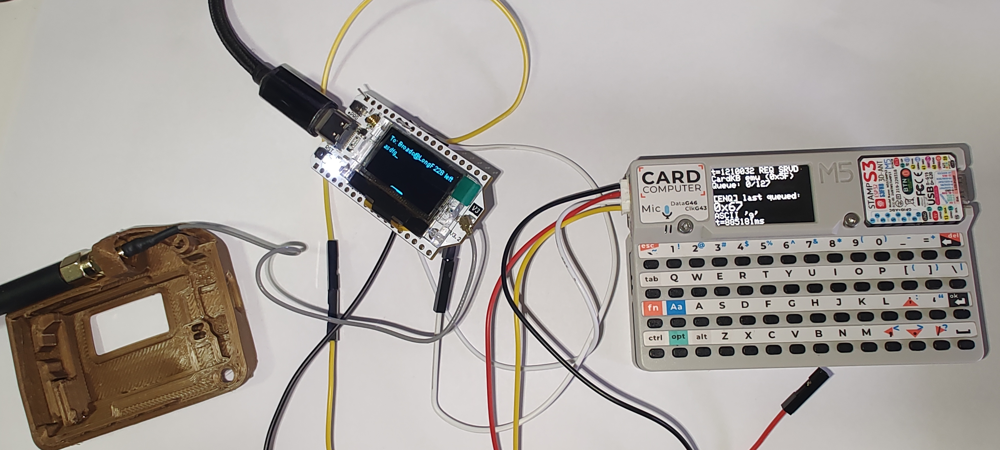

# CardKB Emulator for M5Stack Cardputer

Turn your [M5Stack Cardputer](https://shop.m5stack.com/products/m5stack-cardputer-kit-w-m5stamps3) into a [CardKB](https://shop.m5stack.com/products/cardkb-mini-keyboard)-compatible I2C keyboard. This allows the Cardputer to act as an external keyboard for devices that support CardKB, such as [Meshtastic](https://meshtastic.org/) nodes running on [Heltec LoRa](https://heltec.org/project/wifi-lora-32-v3/) boards.

## Tested Configuration

- **Cardputer**: [M5Stack Cardputer Kit v1.1](https://shop.m5stack.com/products/m5stack-cardputer-kit-w-m5stamps3)
- **Target board**: [Heltec WiFi LoRa 32 V3](https://heltec.org/project/wifi-lora-32-v3/)
- **Firmware**: [Meshtastic 2.7.15](https://meshtastic.org/)

## Features

- I2C slave emulation at standard CardKB address (0x5F)
- 128-byte key buffer
- Arrow key support via Fn+IJKL or Fn+WAS
- Audible keypress feedback (beep on buzzer)
- Clean user display with connection status and text preview
- Debug display mode (toggle with Fn+D)

## Use Case

[Meshtastic](https://meshtastic.org/) firmware on Heltec LoRa boards supports the CardKB keyboard over I2C. This project lets you use the Cardputer's built-in keyboard as a CardKB, enabling text input for Meshtastic without needing a separate CardKB unit.

## Hardware Setup

### Wiring

Connect the Cardputer to your Heltec board via I2C:

| Cardputer (Grove) | Heltec LoRa V3 |
|-------------------|----------------|
| SDA (Yellow)      | GPIO 41        |
| SCL (White)       | GPIO 42        |
| GND (Black)       | GND            |

**Note:** Do not connect VCC if both devices are powered separately.

### I2C Address

The emulator uses the standard CardKB address: `0x5F`

## Dependencies

- [M5Cardputer Library](https://github.com/m5stack/M5Cardputer) (includes M5Unified)

Install via Arduino Library Manager or PlatformIO.

## Building

### Arduino IDE

1. Open `Cardkb_emulator.ino`
2. Select board: **M5Stack Cardputer**
3. Click Upload

### Arduino CLI

```bash
arduino-cli compile --fqbn m5stack:esp32:m5stack_cardputer
arduino-cli upload -p /dev/ttyACM0 --fqbn m5stack:esp32:m5stack_cardputer
```

### Pre-built Binary

Download `Cardkb_emulator.bin` from [Releases](https://github.com/jeroavf/Cardkb_emulator/releases) and flash with esptool:

```bash
esptool.py --chip esp32s3 --port /dev/ttyACM0 write_flash 0x0 Cardkb_emulator.bin
```

## Key Mappings

| Input | Output |
|-------|--------|
| Any character | ASCII code |
| Enter | `0x0D` (CR) |
| Backspace | `0x08` |
| Fn + I or Fn + W | `0xB5` (Arrow Up) |
| Fn + K or Fn + S | `0xB6` (Arrow Down) |
| Fn + J or Fn + A | `0xB4` (Arrow Left) |
| Fn + L | `0xB7` (Arrow Right) |
| Fn + D | Toggle debug/user display |

## Display

### User Mode (default)



- **Connection status**: Green "Connected" when I2C master is polling, gray "Waiting..." otherwise
- **Text preview**: Shows the last characters typed (clears on Enter)

### Debug Mode (Fn+D to toggle)



- **Request status**: Timestamp and status of the last I2C request (REQ RCVD/REQ SRVD)
- **Queue**: Number of keypresses buffered (max 127)
- **[ENQ]**: Last key queued from keyboard input (hex code)
- **[TX]**: Last key sent over I2C to the master device (hex code)

## How It Works

1. Keypresses are captured and stored in a 128-byte ring buffer
2. The Cardputer acts as an I2C slave at address `0x5F`
3. When the master (e.g., Heltec) requests data, the next character is popped from the buffer and sent
4. If the buffer is empty, `0x00` is returned (no key pressed)

## License

MIT
